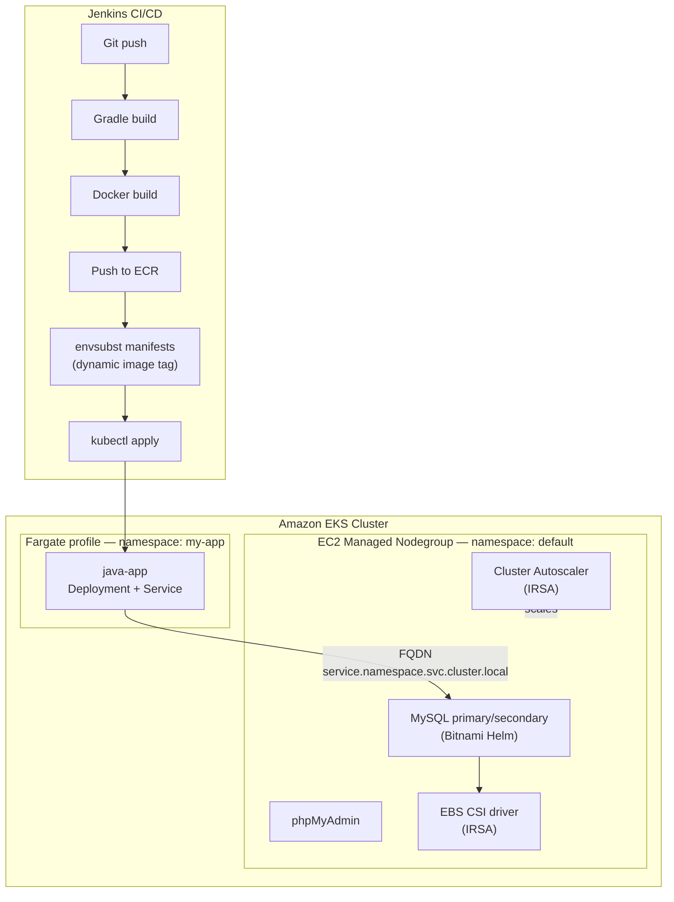
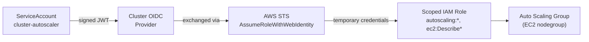

# EKS Hybrid Compute — Fargate + Nodegroup, Stateful Helm & Autoscaling

> **FR** — Cluster Amazon EKS à compute hybride : une application Java Spring Boot tourne sur un profil Fargate dédié, tandis que MySQL (réplication) et phpMyAdmin tournent sur un nodegroup EC2 avec stockage persistant EBS. Le Cluster Autoscaler ajuste le nodegroup via IRSA, et une pipeline Jenkins (Gradle, ECR) construit et déploie l'application.
>
> **EN** — Amazon EKS cluster with hybrid compute: a Java Spring Boot application runs on a dedicated Fargate profile, while MySQL (replication) and phpMyAdmin run on an EC2 managed nodegroup with persistent EBS storage. Cluster Autoscaler scales the nodegroup via IRSA, and a Jenkins pipeline (Gradle, ECR) builds and deploys the application.


---

## Problem

Real workloads on Kubernetes are rarely uniform: a stateless API can run anywhere, but a replicated database needs persistent block storage, stable network identity, and a lifecycle that serverless compute doesn't support. Running everything on one compute model — all EC2 or all Fargate — means either paying for idle nodes under the stateless app, or fighting Fargate's limitations to force stateful workloads onto it. This project's premise: pick the right compute model *per workload*, on the same cluster, and make them talk to each other securely.

## Solution

A single EKS cluster runs two compute models side by side. The Spring Boot application is scheduled onto a **dedicated Fargate profile** (namespace `my-app`) — no nodes to manage, pay per pod. MySQL (primary/secondary replication, via Bitnami Helm) and phpMyAdmin run on a **managed EC2 nodegroup** (namespace `default`) with EBS-backed persistent volumes, since Fargate cannot host stateful, DaemonSet-like, or storage-attached workloads. A **Cluster Autoscaler** — authenticated via IRSA rather than static IAM keys — scales the nodegroup up and down based on pending pod demand. A Jenkins pipeline builds the app with Gradle, pushes to ECR, and deploys with `kubectl apply` against dynamically templated manifests.

## Architecture



### IAM trust chain (IRSA)



## Skills demonstrated

- Designing a hybrid-compute cluster topology instead of defaulting to a single compute model — knowing *when* Fargate applies and when it doesn't
- IRSA end to end: OIDC provider, scoped IAM roles, no static AWS credentials anywhere in the cluster
- Cross-namespace service discovery via full FQDN, and understanding that a Kubernetes namespace is an RBAC/quota boundary, not a network boundary
- Stateful workload management on Kubernetes: EBS CSI dynamic provisioning, StatefulSet replication, PVC lifecycle
- CI/CD to a private container registry (ECR) with dynamically generated, non-hardcoded image tags

## Key technical decisions

| Decision | Why |
|---|---|
| Fargate for the app, EC2 nodegroup for MySQL | Fargate has no DaemonSet support and no direct EBS attachment — stateful workloads need EC2-backed nodes. |
| IRSA instead of static IAM keys | Eliminates any long-lived AWS secret stored in the cluster; credentials are temporary and scoped to exactly what the autoscaler needs. |
| `envsubst` instead of a templating engine for the app manifests | A single image-tag placeholder doesn't justify Helm/Kustomize overhead; Helm is reserved for the stateful MySQL component that actually needs it. |
| Full FQDN instead of short service name | The app and MySQL live in different namespaces; Kubernetes' short-form DNS resolution doesn't cross namespace boundaries. |

## Limitations

- No automated manifest validation (`helm lint` / `kubeval`) as a CI gate before deploy.
- Image tag is derived from the Jenkins build number, not the Git commit hash — limited traceability on rebuilds.
- No externalized secrets manager (Vault, External Secrets Operator); Kubernetes Secrets are the only layer.
- Validated on a single demo cluster — no multi-AZ failover drill performed.

## Roadmap

- [ ] Add `helm lint` and manifest validation as a Jenkins stage before `kubectl apply`
- [ ] Replace manual cluster creation with a versioned Terraform module
- [ ] Externalize secrets via AWS Secrets Manager + External Secrets Operator
- [ ] Tag releases from Git tags instead of the Jenkins build number

## Troubleshooting

Real issues hit while building this, kept because they're more useful than a clean success story:

| Problem | Cause | Fix |
|---|---|---|
| Jenkins pipeline crashes with `NotSerializableException` | A `java.util.regex.Matcher` (used to parse the app version) was kept in a local variable across a `script{}` block that calls `sh` — Jenkins' CPS transformation tries to serialize the entire script state at each checkpoint and fails on non-serializable objects. | Isolate regex parsing in a method annotated `@NonCPS`, or shell out to `grep`/`sed` instead of Groovy regex. |
| `kubectl create namespace` fails with `AlreadyExists` on the second pipeline run | `kubectl create` is not idempotent. | Use `kubectl create namespace X --dry-run=client -o yaml \| kubectl apply -f -` instead. |
| `docker pull` of a known-public image fails with `401 Unauthorized` inside the Jenkins container | A stale/expired Docker Hub session in `~/.docker/config.json` is used for *every* interaction with `docker.io`, including anonymous pulls — and that config is scoped to the user the shell step runs as, which may not be the user a manual `docker exec` lands on. | `docker logout` as the actual pipeline user (`docker exec -u jenkins -it <container> bash`, not the default root shell) before retrying. |
| ECR-backed pod suddenly gets `ErrImagePull` after ~12 hours | ECR authentication tokens (`aws ecr get-login-password`) expire after 12h; a token cached as a static credential goes stale. | Regenerate the token on every pipeline run from already-configured AWS credentials — never store it as a long-lived Jenkins credential. |
| Cluster Autoscaler pod never becomes ready after a Helm install | The chart's `image.tag` didn't match the EKS control plane's minor version. | Match the Cluster Autoscaler image tag to `kubectl version` (server minor version), within ±1 minor version if an exact match isn't published yet. |
| `kubectl get pods -l app.kubernetes.io/instance=<release>` returns nothing after a Helm install | Helm-created resource names are prefixed/suffixed by the chart, not necessarily equal to the release name (e.g. `cluster-autoscaler-aws-cluster-autoscaler-...`). | Filter by the `app.kubernetes.io/instance` label rather than assuming an exact resource name. |

---

## FR — Détails d'implémentation

### Compute hybride : Fargate + Nodegroup

Profil Fargate dédié (namespace `my-app`) pour l'application Spring Boot, isolé du nodegroup EC2 managé (namespace `default`) qui héberge MySQL et phpMyAdmin. Un namespace Kubernetes est une frontière logique (RBAC, quotas), pas une frontière réseau — tous les pods du cluster partagent le même réseau VPC. Seule la résolution DNS courte est limitée au namespace courant : l'application cible donc le service MySQL par son FQDN complet plutôt que par son nom court.

### Déploiement stateful avec Helm

MySQL déployé en mode `replication` (primaire/secondaire) via le chart Bitnami, avec persistance EBS provisionnée dynamiquement par l'EBS CSI driver (authentifié via IRSA, sans credentials statiques dans le cluster). phpMyAdmin déployé en complément pour l'administration de la base.

### Cluster Autoscaler (IRSA)

Le nodegroup EC2 s'ajuste automatiquement à la demande de pods en attente, via un rôle IAM restreint (fédération OIDC) plutôt que des clés statiques. Les Service Accounts Kubernetes ne sont pas des entités IAM : IRSA fait le pont en échangeant un token JWT signé par l'émetteur OIDC du cluster contre des credentials AWS temporaires, scopés au strict nécessaire.

### Pipeline CI/CD Jenkins

Build Gradle, image Docker poussée vers Amazon ECR, manifests Kubernetes templatés avec `envsubst` puis appliqués via `kubectl`. Le tag d'image est généré dynamiquement (numéro de build Jenkins), jamais hardcodé dans les manifests déployés.

## EN — Implementation Details

### Hybrid compute: Fargate + Nodegroup

Dedicated Fargate profile (`my-app` namespace) for the Spring Boot application, isolated from the managed EC2 nodegroup (`default` namespace) hosting MySQL and phpMyAdmin. A Kubernetes namespace is a logical boundary (RBAC, quotas), not a network one — all pods share the same VPC network. Only short-form DNS resolution is limited to the current namespace, so the application targets MySQL by its full FQDN rather than its short name.

### Stateful deployment with Helm

MySQL deployed in `replication` mode (primary/secondary) via the Bitnami chart, with EBS persistence dynamically provisioned by the EBS CSI driver (IRSA-authenticated, no static credentials in-cluster). phpMyAdmin deployed alongside for database administration.

### Cluster Autoscaler (IRSA)

The EC2 nodegroup scales automatically based on pending pod demand, through a scoped IAM role (OIDC federation) rather than static keys. Kubernetes Service Accounts aren't IAM entities — IRSA bridges that gap by exchanging a JWT token signed by the cluster's OIDC issuer for temporary AWS credentials, scoped to the bare minimum.

### Jenkins CI/CD pipeline

Gradle build, Docker image pushed to Amazon ECR, Kubernetes manifests templated with `envsubst` and applied via `kubectl`. The image tag is generated dynamically (Jenkins build number), never hardcoded in the deployed manifests.

---

## Prerequisites

- An AWS account with IAM rights to create EKS clusters, Fargate profiles, OIDC providers and IAM roles
- `eksctl`, `kubectl`, `helm`, `aws-cli`
- A Jenkins instance with the Gradle and Kubernetes CLI plugins
- An existing ECR repository for the application image

## Jenkins Prerequisites

| Credential ID | Type | Usage |
|---|---|---|
| `ecr-credentials` | Username/Password | Docker login to Amazon ECR |
| `jenkins_aws_access_key_id` | Secret text | AWS IAM auth for EKS (`eks update-kubeconfig`) |
| `jenkins_aws_secret_access_key` | Secret text | AWS IAM auth for EKS |

| Tool | Provisioning |
|---|---|
| Gradle | Jenkins Gradle plugin (`tools { gradle 'gradle' }`), auto-installed |
| kubectl / AWS CLI | Installed on the Jenkins agent |

## Project Structure

```
.
├── Jenkinsfile                          # CI/CD pipeline (Gradle build, ECR push, kubectl deploy)
├── Dockerfile                           # Java app image (Eclipse Temurin 21)
├── build.gradle / settings.gradle       # Gradle project (Spring Boot 3)
├── manifests/
│   ├── java-app.yaml                    # Deployment + Service (Fargate, namespace my-app)
│   ├── java-app-configMap.yaml          # DB connection config (cross-namespace FQDN)
│   ├── java-app-secret.yaml             # DB credentials
│   ├── phpmyadmin.yaml                  # phpMyAdmin Deployment + Service
│   └── ingress.yaml                     # Ingress routing
├── mysql/values.yaml                    # Bitnami MySQL Helm values (replication + EBS)
├── charts/app/                          # Reusable Helm chart (used by helmfile)
├── values/                              # Helmfile values per release
├── helmfile.yaml                        # Helmfile release definitions
└── src/                                 # Java Spring Boot application source
```
